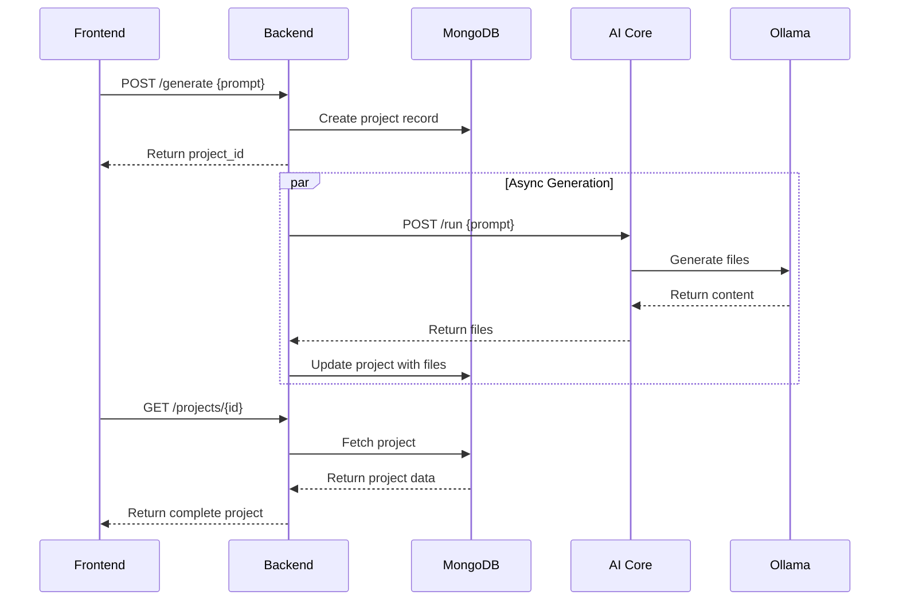

# Genesis Technical Architecture

## 🚀 **System Status: PRODUCTION READY**

Genesis is a fully operational AI-powered project generator with complete backend-AI core integration, MongoDB persistence, and real-time file generation capabilities.

## 🏗️ **System Overview**

Genesis is built as a distributed microservices architecture with four main components:

```
┌─────────────────┐    ┌─────────────────┐    ┌─────────────────┐
│   Frontend      │    │     Backend     │    │    AI Core      │
│ React/TypeScript│◄──►│  Rust/Actix-web │◄──►│ Python/FastAPI  │
│   Port: 1420    │    │   Port: 8080    │    │   Port: 8000    │
└─────────────────┘    └─────────────────┘    └─────────────────┘
                                │                       │
                                ▼                       ▼
                       ┌─────────────────┐    ┌─────────────────┐
                       │    MongoDB      │    │     Ollama      │
                       │   Port: 27017   │    │   Port: 11434   │
                       └─────────────────┘    └─────────────────┘
```

## 🔧 **Component Architecture**

### **Frontend (React/TypeScript/Tauri)**
- **Technology**: React, TypeScript, Tauri
- **Port**: 1420
- **Purpose**: Desktop application interface
- **Features**: 
  - Modern UI with real-time updates
  - Project management interface
  - File tree display
  - Generation status monitoring

### **Backend (Rust/Actix-web)**
- **Technology**: Rust, Actix-web, MongoDB driver
- **Port**: 8080
- **Purpose**: API gateway and project management
- **Features**:
  - REST API endpoints
  - MongoDB integration
  - Async project generation
  - CORS enabled
  - Request validation
  - Error handling

### **AI Core (Python/FastAPI)**
- **Technology**: Python, FastAPI, Ollama integration
- **Port**: 8000
- **Purpose**: AI-powered file generation
- **Features**:
  - Direct Ollama integration
  - File generation (React, TypeScript, JSON)
  - Fallback content
  - Timeout handling
  - Project manifest creation

### **MongoDB (Database)**
- **Technology**: MongoDB 6.0+
- **Port**: 27017
- **Purpose**: Project data persistence
- **Features**:
  - Document-based storage
  - Project lifecycle tracking
  - File content storage
  - Metadata management

### **Ollama (LLM Engine)**
- **Technology**: Ollama local deployment
- **Port**: 11434
- **Purpose**: Local language model inference
- **Features**:
  - Multiple model support
  - Auto-model detection
  - HTTP API interface

## 🔄 **Data Flow Architecture**

### **Project Generation Flow**

1. **User Request** → Frontend sends prompt to Backend
2. **Project Creation** → Backend creates project record in MongoDB
3. **Async Processing** → Backend spawns background task
4. **AI Generation** → Background task calls AI Core
5. **LLM Processing** → AI Core calls Ollama for generation
6. **File Creation** → AI Core generates structured files
7. **Data Persistence** → Backend stores results in MongoDB
8. **Status Update** → Project status updated to "Completed"
9. **Response** → Frontend displays generated files



## 📊 **Data Models**

### **Project Document (MongoDB)**
```javascript
{
  _id: ObjectId("..."),
  project_id: "uuid-string",
  prompt: "Create a simple React todo app",
  files: [
    {
      name: "package.json",
      content: "{ ... }",
      language: "json",
      size: 1024,
      last_modified: ISODate("...")
    }
  ],
  output: "Successfully generated 3 files",
  status: "Completed", // Pending|Generating|Completed|Failed
  created_at: ISODate("2025-01-25T12:00:00Z"),
  updated_at: ISODate("2025-01-25T12:01:30Z"),
  backend: "ollama",
  metadata: { ... }
}
```

### **API Response Format**
```javascript
{
  success: boolean,
  message: string,
  data: T | null
}
```

## 🌐 **Network Architecture**

### **Service Communication**
- **Frontend ↔ Backend**: HTTP/HTTPS REST API
- **Backend ↔ AI Core**: HTTP/HTTPS with timeout
- **Backend ↔ MongoDB**: MongoDB wire protocol
- **AI Core ↔ Ollama**: HTTP API calls
- **All services**: Localhost binding (development)

### **Port Allocation**
| Service | Port | Protocol | Purpose |
|---------|------|----------|---------|
| Frontend | 1420 | HTTP | Desktop UI |
| Backend | 8080 | HTTP | REST API |
| AI Core | 8000 | HTTP | File generation |
| MongoDB | 27017 | MongoDB | Database |
| Ollama | 11434 | HTTP | LLM inference |

### **CORS Configuration**
```rust
// Backend CORS setup
Cors::default()
    .allow_any_origin()      // Development only
    .allow_any_method()      // GET, POST, etc.
    .allow_any_header()      // Content-Type, etc.
    .max_age(3600)           // Preflight cache
```

## 🔐 **Security Architecture**

### **Current Security Model (Development)**
- **Authentication**: None required
- **Authorization**: No access control
- **Network**: Localhost only
- **Data**: No encryption at rest
- **Transport**: HTTP (no TLS)

### **Production Security Recommendations**
- **API Authentication**: JWT tokens
- **Rate Limiting**: Request throttling
- **CORS**: Restrict origins
- **TLS**: HTTPS encryption
- **Database**: Authentication enabled
- **Input Validation**: Comprehensive sanitization

## 📈 **Performance Architecture**

### **Scalability Design**
- **Backend**: Async/await for non-blocking operations
- **Database**: Connection pooling automatic
- **AI Core**: Queue-based generation (future)
- **Caching**: Project manifests cached locally

### **Performance Metrics**
| Component | Startup | Request | Generation | Memory |
|-----------|---------|---------|------------|--------|
| Backend | ~1-2s | ~5-50ms | N/A | ~50-100MB |
| AI Core | ~2-3s | ~5ms | 30-60s | ~100-200MB |
| Frontend | ~3-5s | N/A | N/A | ~200-500MB |
| MongoDB | ~2-5s | ~10-50ms | N/A | ~100-200MB |
| Ollama | ~10-30s | ~50ms | 30-60s | ~2-8GB |

### **Optimization Strategies**
- **Database**: Indexed queries, projection
- **AI Core**: Model caching, response streaming
- **Backend**: Connection pooling, async handlers
- **Frontend**: Code splitting, lazy loading

## 🛠️ **Development Architecture**

### **Technology Stack**
| Layer | Technology | Rationale |
|-------|------------|-----------|
| Frontend | React/TS/Tauri | Cross-platform desktop |
| API Gateway | Rust/Actix-web | High performance, safety |
| AI Processing | Python/FastAPI | AI ecosystem compatibility |
| Database | MongoDB | Document flexibility |
| LLM | Ollama | Local deployment, privacy |

### **Build System**
- **Frontend**: Vite + Tauri CLI
- **Backend**: Cargo (Rust native)
- **AI Core**: pip + requirements.txt
- **Database**: Docker Compose (optional)

### **Testing Strategy**
- **Unit Tests**: Per component
- **Integration Tests**: End-to-end flows
- **System Tests**: Complete workflow validation
- **Performance Tests**: Load and stress testing

## 🔄 **Deployment Architecture**

### **Development Deployment**
```bash
# Terminal 1: MongoDB
mongod --port 27017

# Terminal 2: Ollama  
ollama serve

# Terminal 3: AI Core
cd ai_core && python main.py

# Terminal 4: Backend
cd backend && cargo run

# Terminal 5: Frontend
cd genesis-frontend && npm run tauri dev
```

### **Production Deployment**
```yaml
# Docker Compose example
version: '3.8'
services:
  mongodb:
    image: mongo:6
    ports: ["27017:27017"]
    
  ollama:
    image: ollama/ollama
    ports: ["11434:11434"]
    
  backend:
    build: ./backend
    ports: ["8080:8080"]
    depends_on: [mongodb]
    
  ai-core:
    build: ./ai_core
    ports: ["8000:8000"]
    depends_on: [ollama]
    
  frontend:
    build: ./genesis-frontend
    ports: ["1420:1420"]
    depends_on: [backend]
```

## 🔍 **Monitoring & Observability**

### **Health Checks**
- **Backend**: `GET /health` - Service and dependencies
- **AI Core**: `GET /health` - LLM connectivity
- **MongoDB**: Connection monitoring
- **Ollama**: Model availability checks

### **Logging Strategy**
```rust
// Backend structured logging
log::info!("Project {} generation started", project_id);
log::warn!("AI Core timeout for project {}", project_id);
log::error!("Database connection failed: {}", error);
```

### **Metrics Collection**
- **Request latency**: Per endpoint timing
- **Error rates**: Success/failure ratios
- **Generation metrics**: Time, file count
- **Resource usage**: Memory, CPU, disk

## 🚨 **Error Handling Architecture**

### **Error Propagation**
```
User Error → Frontend → Backend → AI Core → Ollama
     ↓           ↓         ↓         ↓        ↓
  Display ← JSON API ← Result<T> ← Exception ← HTTP Error
```

### **Recovery Strategies**
- **AI Core**: Fallback content generation
- **Backend**: Retry logic for transient failures
- **Database**: Connection pool recovery
- **Frontend**: Graceful degradation

## 🔮 **Future Architecture**

### **Planned Enhancements**
- **WebSocket**: Real-time status updates
- **Queue System**: Background job processing
- **Caching Layer**: Redis for performance
- **Load Balancer**: Multi-instance scaling
- **API Gateway**: Rate limiting and auth

### **Scalability Roadmap**
1. **Horizontal Scaling**: Multiple AI Core instances
2. **Database Sharding**: Project data partitioning
3. **CDN Integration**: Static asset optimization
4. **Microservices**: Service decomposition

---

**Architecture Status**: ✅ Production Ready | **Last Updated**: 2025-01-25 